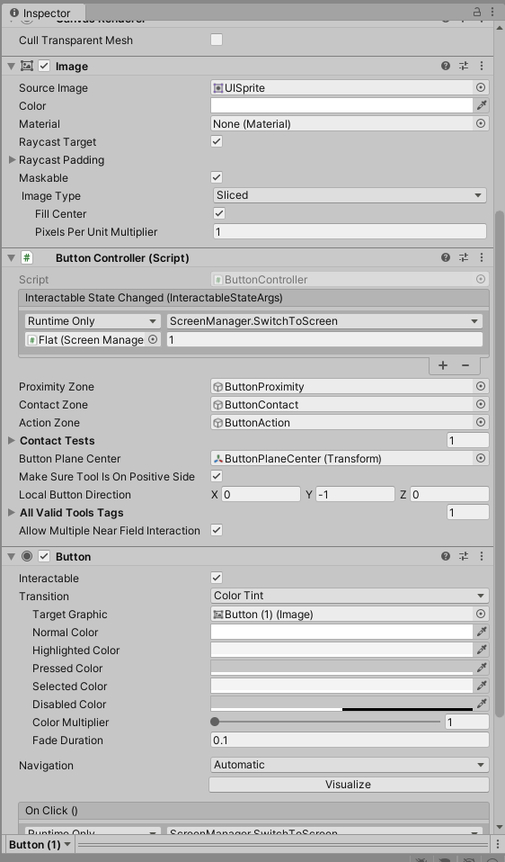
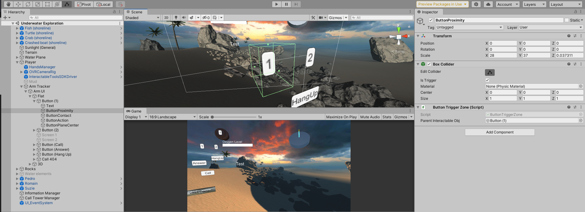

# Final tips

## 0. I haven't tried my project on the Oculus

### _**Run to CSIL ASAP and do that.**_

## 1. Two AudioListeners warning

Go to your `AR Goggles` GameObject and disable the `AudioListener`. Alternatively can be found by searching "AudioListener" in the Scene Hierarchy search bar, which will look for anything with that name (including components/scripts in scene).

## 2. My buttons don't work in Oculus! [IMPORTANT!]

**Don't freak out! This should be a quick correction.** One of the trade-offs we had to make so that students could prototype on their laptop is having two simultaneous systems handle events. When you make buttons, make sure you have these two components on them:

Both the `Button` script (handles default laptop/screen-based clicks and the `Button Controller` script (handles touching the button in Oculus) should be on your Button GameObject. Make sure (1) the `Button Controller` script's Interactable State Changed match the On Click () events of the `Button` script so that functionality is the same across laptop and Oculus. (2) You will have to make colliders specifically for Oculus interactions (for each of your buttons). You can look at how `Button 1` is structured in the template for example. These are: `Proximity Zone`, `Contact Zone`, and `Action Zone`, alongside a position for the button's center (`Button Plane Center`) fields in the `Button Controller` script.

You'll have to modify these collider GameObjects and Center to match the dimensions of your current button. See below:

## 3. I have X error...

Immediately copy and paste the error into an email and send it to us. We can't promise we'll be able to resolve it, but this helps a lot alongside a description of what you are doing / tried to do.

## 4. I'm on a Mac and I get an Oculus Error

Macs will likely throw errors that require you unPause the game (click pause button after play is paused). This is just because Macs do not support Oculus and you don't have the Oculus Link. This should be fine: just make sure you test on the Windows desktop with the Oculus ASAP.

## 5. I'm trying to do this specific thing...

1. We're happy to listen to what you are trying, but we will not give you a guide on how to implement something. That's up to you!
2. If you are having difficulties or errors, see 2. We can probably help out then.
3. Have you checked the Unity Documentation or Forums?
4. Finally, there are lots of ways to do any particular thing in Unity. This means that (A) the TAs may be able to help, but also (B) the TAs may not be familiar with what you are trying to use. We'll try to help as much as we can within reason.
5. Break your problem down into multiple steps and make those bite-sized things to tackle.
6. Think about your priorities for the project. Is X thing worth investing Y hours of work at this stage versus completing the Minimum Viable Experience? You can get fancy when you know things are at a decent baseline.

## 6. I'm working with co-routines!

That's great! Just remember two things (1) coroutines that edit the same variable can conflict (especially if you are trying to produce time-specific behavior with waits) and (2) **if you call a coroutine in Update (with safe guards to make sure it's only called on the specific frame[s] you want), then it will be called every frame and each routine will run in parallel until done**.

## 7. Something went wrong and I'm using [X Unity version that wasn't mentioned in the assignment]

We'll try to help, but chances are you'll be on your own for this one. Coordinate with your teammates to work on your project if necessary. Pardon the trouble. (We believe we've interfaced with all the students in this situation, but - if not - reach out to us ASAP.)

## 8. I don't see the Underwater AR Scene?

Have you opened the right scene? Are you too zoomed out (click on a small object in hierarchy, hover over Scene window, press "f" to auto zoom)? If you are asking this now, you should get cracking on your project!

## 9. I don't see my hands while using the Oculus!

Make sure you don't use the Oculus controllers. Instead, restart the headset and start by using your hands by holding them stretched out in front of the Quest headset.

## 10. The Arm UI isn't following my hand

1. Check that the tracking toggle is set to true on the `Arm Tracker` GameObject.
2. Make sure UI anchored to the arm is nested in the `Arm Tracker` GameObject.