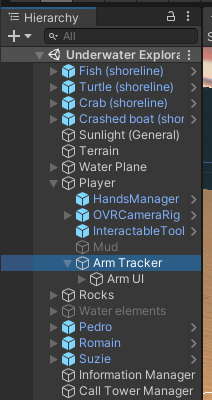
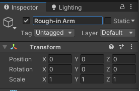
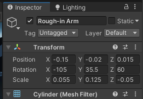
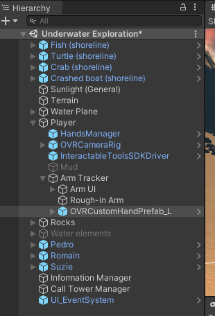
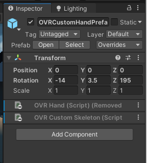
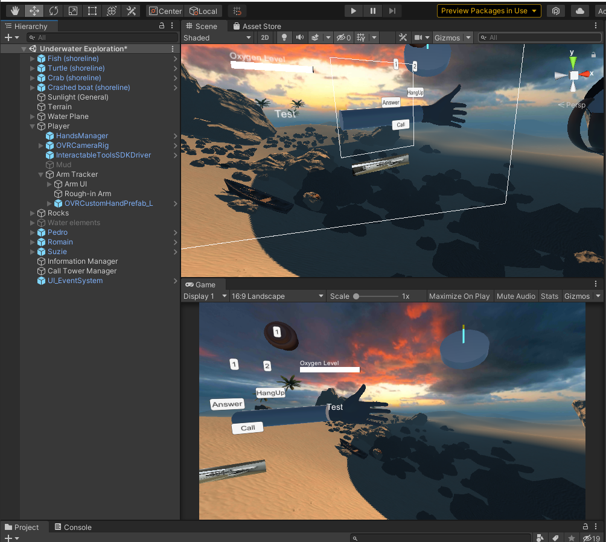
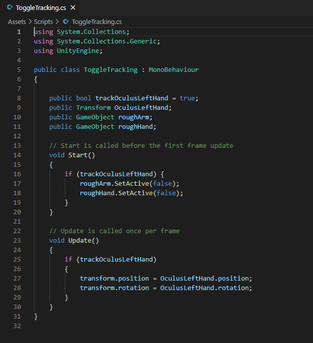
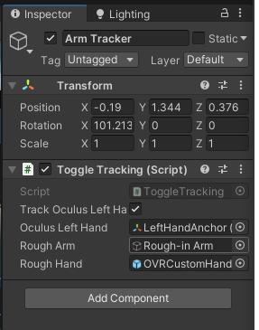

# Tutorial: Forearm & Hand for prototyping

## 1. Add the arm

Under `Player > Arm Tracker` GameObject...

Create a new Cylinder as a child of `Arm Tracker` and name it `Rough-in Arm`:

Then, delete its `Capsule Collider` component and adjust the Transform values to match the following:

Position: -0.15, -0.02, 0.015

Rotation: -105, 35.5, 60

Scale: 0.055, 0.125, -0.05

## 2. Add the hand

In your `Assets` folder (Project tab), go to `Oculus > VR > Prefabs`. Then Drag and Drop the `OVRCustomHandPrefab_L.prefab` under the `Arm Tracker` GameObject of the Scene Hierarchy.

Then delete both OVR Components from the GameObject, and modify the Transform as follows:

Position: 0, 0, 0

Rotation: -14, 3.5, 195

Scale: 1, 1, 1

You should now see:

## 3. Make them disappear when the Arm UI tracks the Oculus 

Since this is only meant for when you use the laptop, you need to modify the `Arm Tracker`'s `ToggleTracking.cs` Component script code to handle turning on and off the `Rough-in Arm` and the `OVRCustomHandPrefab_L` GameObjects when you are using the Oculus Quest 2.

3.1. Open the `ToggleTracking.cs` script and modify the code accordingly:

This makes it so that, when the Oculus Left Hand tracking boolean is true, the two GameObjects are disabled at Play.

3.2. Save the code and then return to Unity. Now Drag and Drop the two GameObjects to their respective fields in the `Toggle Tracking` Component of the `Arm Tracker` GameObject:

Now, when you toggle the track on (e.g., when you want to use the Oculus), the `Arm UI` tracks the Oculus Quest 2 left hand and the two rough-in GameObjects are hidden. Make sure to keep this boolean on **false** if you are working on your laptop/computer without an Oculus Quest 2.

